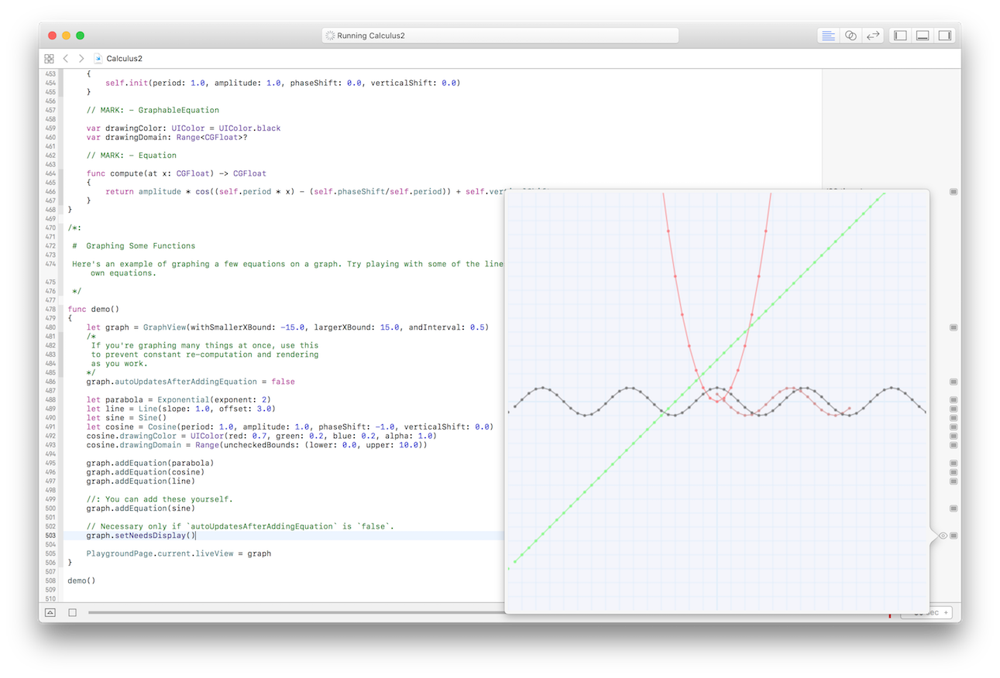
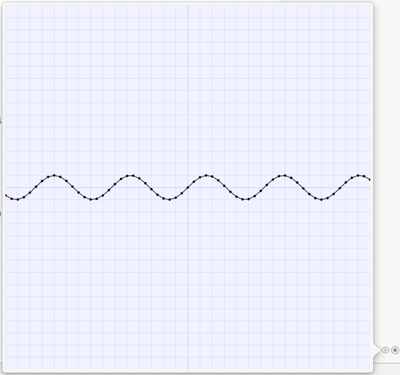
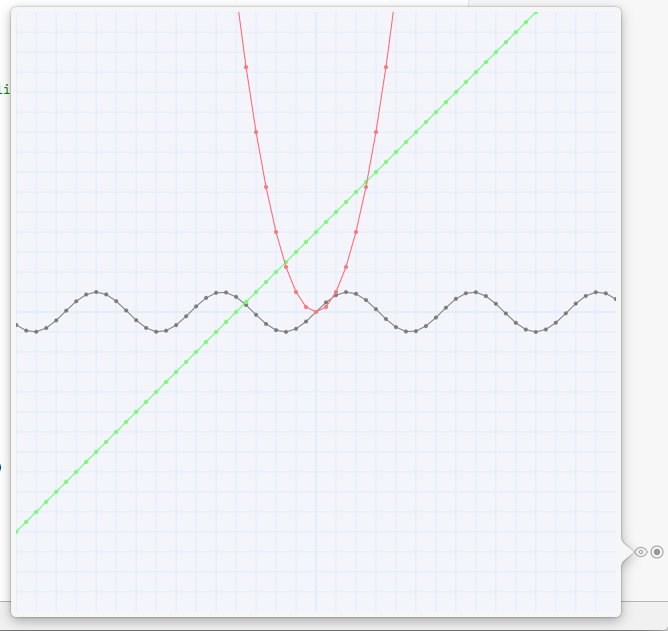

# Precalc
This repo contains some code which can graph equations in a UIView.

[](./demo.png)

Summary:
---

Basically, you define an equation, tell the graph what color to draw in, and CoreGraphics does the rest.

I've been meaning to make something like this during precalculus and then during calculus 1, so before I take calc 2, I'm finally making this thing.

Technical:
---

Written during bus and subway commutes using Xcode 7.3.1 and Swift 2.2.

Using It:
---

You can draw one of the predefined graphs by instantiating a `GraphView`, an instance of a `GraphableEquation`, and then adding it to the `GraphView`:

```swift
let graph = GraphView(withSmallerXBound: -15.0, largerXBound: 15.0, andInterval: 0.5)
let sine = Sine()
graph.addEquation(sine)
```

Here's the output:



You can add multiple equations to a single GraphView, like so:

```swift
let graph = GraphView(withSmallerXBound: -15.0, largerXBound: 15.0, andInterval: 0.5)

let sine = Sine()
let line = Line(slope: 1.0, offset: 4.0)
let exponential = Exponential(exponent: 2.0)

graph.addEquation(sine)
graph.addEquation(line)
graph.addEquation(exponential)

// As of 1.1.0, you need to tell the graph view to render, by calling setNeedsDisplay()
graph.setNeedsDisplay()
```    
    
Check it out:



About the Graph View:
---

The initializer of the `GraphView` sets up how the graph should be drawn, mimicing how you might do it in real life:

```swift
let graph = GraphView(withSmallerXBound: -15.0, largerXBound: 15.0, andInterval: 0.5)
```

The "smaller x bound" is the negative x value on the left edge, and the "larger" one is the positive x value off to the right.

Graphs are always square, and scale to fit inside the frame of the GraphView. (The frame is currently hard coded to some value I liked during testing. There's a TODO to make this customizable.)

If you make the bounds farther apart from each other, the graph will have smaller boxes, more points, and take longer to draw. If you make the X values closer to each other, you get... bigger boxes, fewer points, and maybe a quicker draw. 

The interval is how often along the X axis we want equations to calculate a Y value. Think of this as how many points we want to draw on each square on our graph paper.

Implementing Your Own Equations:
---

To add your own equation, conform to the `Equation` protocol:

```swift
protocol Equation
{
    func compute(at x: CGFloat) -> CGFloat   
    var domain: Range<CGFloat>? { get set }
}
```

---
Note: Previous versions of this playground used a different version of the Equation protocol, which pre-cached coordinates. That approach made it difficult to batch equation computations together, and prevented function composition, so it was removed.
---
    
The graph view can draw your equation if you implement the compute function and also adopt `GraphableEquation`, which defines the color of your drawing on the graph.

```swift
protocol GraphableEquation : Equation {
    var drawingColor : UIColor { get set }
}
```

Here's an example `GraphableEquation` implementation for the sine formula we used earlier:

```swift
//: Sine

class Sine : GraphableEquation
{
    var period: CGFloat
    var amplitude: CGFloat
    var phaseShift: CGFloat
    var verticalShift: CGFloat
    
    // MARK: - Initializer
    
    init(period: CGFloat, amplitude: CGFloat, phaseShift: CGFloat, verticalShift: CGFloat)
    {
        self.period = period
        self.amplitude = amplitude
        self.phaseShift = phaseShift
        self.verticalShift = verticalShift
    }
    
    convenience init()
    {
        self.init(period: 1.0, amplitude: 1.0, phaseShift: 0.0, verticalShift: 0.0)
    }
    
    // MARK: - GraphableEquation
    
    var drawingColor: UIColor = UIColor.black
    var domain: Range<CGFloat>?
    
    // MARK: - Equation
    
    func compute(at x: CGFloat) -> CGFloat
    {
        return amplitude * cos((self.period * x) - (self.phaseShift/self.period)) + self.verticalShift
    }
}

```

We just implement the formula for a sine wave, taking into account the possible transformations built into the equation.

The cool thing about this protocol based system is that we can implement convenience initializers specific to our function, and as long as we can supply the graph with coordinates, it will do the right thing. 

For example, our sine equation has an amplitude parameter. A line equation might have a slope and an offset instead. For example:

```swift
let line = Line(slope: 1.0, offset: 3.0)
```

There's more information in the playground, so take a look! (If you're feeling ambitious, maybe take a stab at one of these TODO items.)

TODO:
---

See [Issues](https://github.com/MosheBerman/Precalc/issues).

License:
---
MIT
